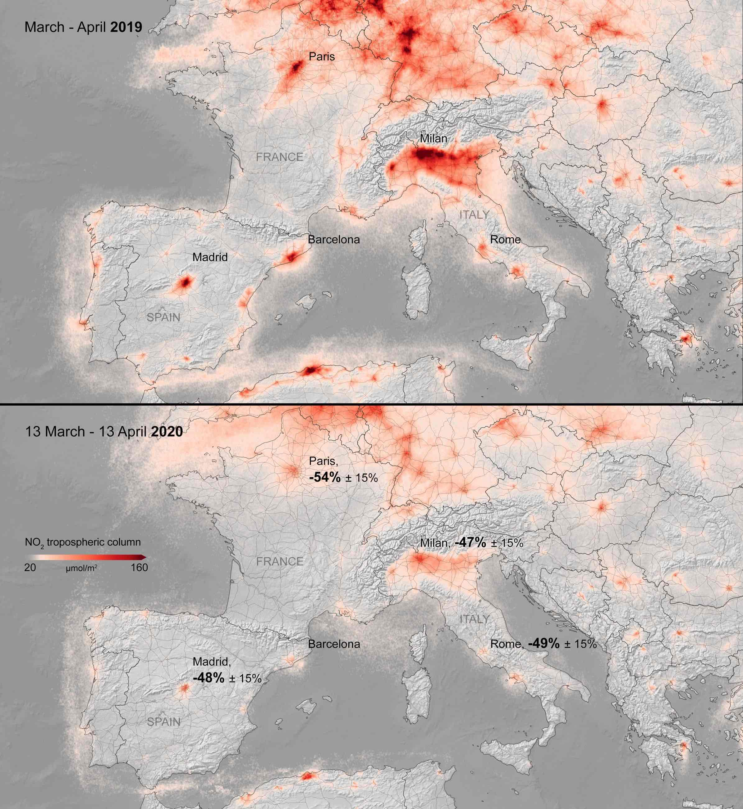
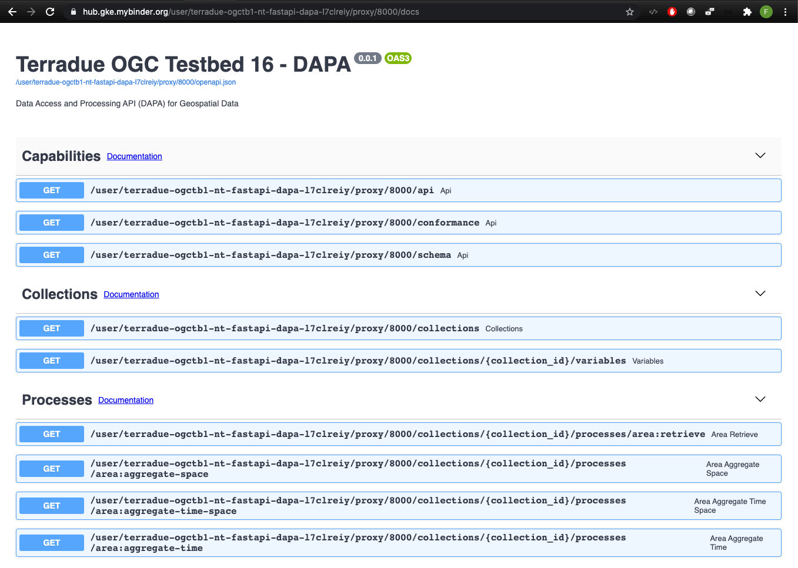
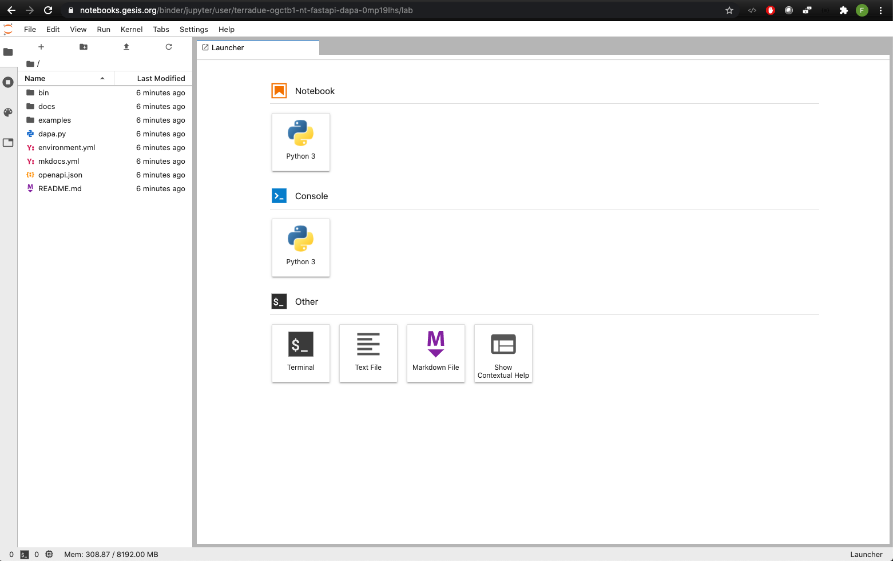

This demonstrator uses Sentinel-5P tropospheric NO2 column density to show-case the DAPA API approach for gridded data and supports the DAPA API evaluation by several data scientists or earth scientists regarding:

- Learning curve to use the API

- Richness of accessible functionality

- Amount of code needed to execute some common analyses

The typical user stories under evaluation are:

* _As a data scientist, I want to access geospatial data for a specific area in a simple function call_

* _As a data scientist, I want to retrieve data for a single point in time or as an average value over a time period._

* _As a data scientist, I want to retrieve a single value that averages all data in the target geometry for each time step._

* _As a data scientist, I want to retrieve the full time series for each data point._ 

* _As a data scientist, I want to  calculate the minimum, maximum, and average values for any given data retrieval subset_

The outcome of the evaluation will allow the API developers and endpoint providers to further refine the DAPA API and increase ease of use based on the feedback provided by the scientists.

### About the Sentinel-5P tropospheric NO2 column density dataset 

This demonstrator uses data from the Copernicus Sentinel-5P satellite and exposes the monthly (from May 2018 to April 2020) averaged nitrogen dioxide concentrations over a portion of Europe. 
Concentrations of short-lived pollutants, such as nitrogen dioxide, are indicators of changes in economic slowdowns and are comparable to changes in emissions.

Learn more about the impact of COVID-19 on the NO2 concentration with the following resources:

- <a href="http://www.esa.int/Applications/Observing_the_Earth/Copernicus/Sentinel-5P/Air_pollution_remains_low_as_Europeans_stay_at_home" target="_blank">Air pollution remains low as Europeans stay at home</a>  
- <a href="https://eo4society.esa.int/2020/05/14/is-the-global-covid-19-related-drop-in-no2-pollution-coming-to-an-end/" target="_blank">Is the global covid-19 related drop in NO2 pollution coming to an end?</a>

### Getting familiar with the environment

Binder hosts this demonstration providing:

- [DAPA OpenAPI documentation](../8000/docs) 

 <a href="../8000/docs" target="_blank"><a>

- A [JupyterLab](../../lab) interface to run the examples and explore the DAPA API with additional notebooks

 <a href="../../lab" target="_blank"><a>

- [This documentation](./)

We recommend using a different browser tab for each of the resources above

### Getting familiar with the API

First, open the [DAPA OpenAPI documentation](../8000/docs) and try each API call sequentially.

When asked for a location, we suggest setting a free text value such as `Paris, France`.
     
Then go to back to [Getting started section of this documentation](./started/) and run the Jupyter Notebooks sequentially.

At this stage, you should be familiar with the API and can thus start your own new notebooks using the provided [JupyterLab](../../lab) environment.
